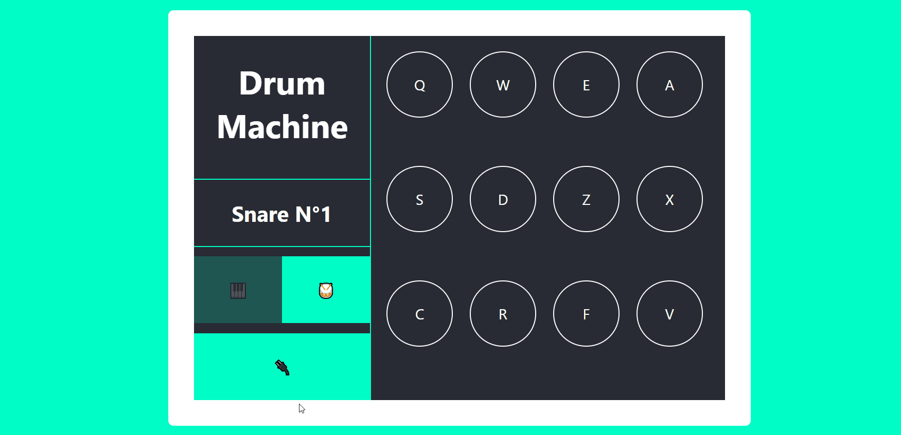

# React Drum Machine

A drum machine built with React and ❤️ as part of the FreeCodeCamp Front-end certification. 
The specification page can be found here: [drum-machine](https://learn.freecodecamp.org/front-end-libraries/front-end-libraries-projects/build-a-drum-machine)

---

## Installation

Clone the repo `git clone`

Install dependencies `npm install`

Start with `npm start` and open [http://localhost:3000](http://localhost:3000) to view it in the browser.

---

## How to play music

1. Click on the 🔌 button
2. Choose your sounds bank with the buttons 🎹 or 🥁
3. Click on pads or use your keyboard to play sounds (keys supported: Q, W, E, A, S, D, Z, X, C, R, F, V)

## Freecodecamp test

This application does not pass the 6th Freecodecamp test. 

This is caused by the higher number of pads in this version. To pass all the tests, simply delete the last 3 soundsbank entries in: `App.js` -> `this.state` -> `Soundsbank`
or search to work `Here` in `App.js` and follow the comments.

With 12 pads:

With 9 pads:

### Sounds

Piano Sounds are download from [Freesound](https://freesound.org).
Drums Sounds are download from [99sounds](http://99sounds.org).

### License

This application was made with [Create React App](https://github.com/facebook/create-react-app) and [licensed as MIT](License.md).

